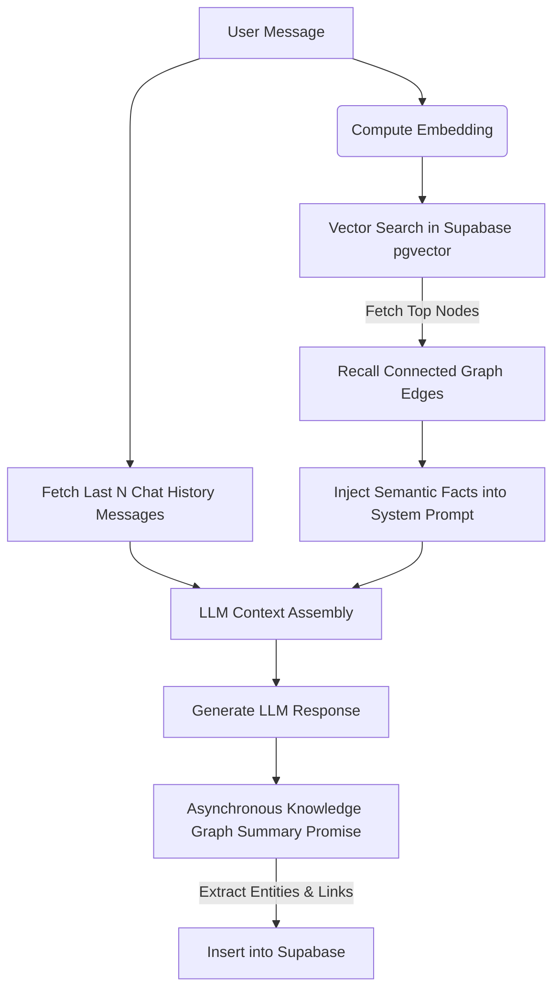

# System Architecture & Cognitive Engine 🧠🏗️

This document details the technical design and architectural flow of **Mindly AI**, including our dual-channel memory retrieval systems, serverless-optimized embedding pipelines, and Supabase RLS security design.

---

## 🎨 Cognitive System Overview

Mindly AI simulates human memory by combining high-speed conversation context (Short-Term memory) with a persistent, searchable semantic knowledge graph (Long-Term memory). 

---

## 🧠 Dual-Channel Memory Engine

To prevent the LLM from "forgetting" details across long periods of time or completely new chat sessions, we implement a hybrid retrieval architecture:

### 1. Short-Term Memory (Context Window)
*   We persist message logs in the `messages` table grouped by `user_id`.
*   During a chat interaction, the chat API loads the last **15 messages** sequentially to preserve conversational continuity and immediate context.

### 2. Long-Term Memory (Vector Knowledge Graph)
*   **Node Representation**: The `memory_nodes` table holds entities (e.g. Person: `Sarah`, Preference: `loves strong black coffee`). The semantic content is embedded into a **384-dimensional vector** using the `pgvector` extension.
*   **Edge Representation**: The `memory_edges` table stores labeled, directed links (e.g. `Sarah` ➔ `prefers` ➔ `black coffee`).
*   **Retrieval Mechanics (Dynamic Cognitive Recall)**:
    1.  When a user enters a query (e.g. *"What should I brew for my sister Sarah when she visits?"*), we generate a 384-dimensional vector of the query.
    2.  We perform a cosine similarity vector search (`match_nodes` RPC) to retrieve the **Top 5 most semantically relevant nodes** (relevance threshold `0.25`).
    3.  For each matching node, we execute a database RPC (`get_node_neighbors`) to load **all connected links and nodes**.
    4.  These graph fragments are parsed into plain-English statements (e.g., *"Sarah prefers black coffee"* and *"Sarah is the user's sister"*) and injected straight into the LLM system prompt!
    5.  **Result**: The AI immediately remembers personal relations and detailed preferences even if they were mentioned months ago in a completely different session!

---

## ⚡ Resilient 4-Stage Embedding Pipeline

Serverless Vercel environments enforce strict startup and process termination rules. To ensure 100% database query stability while remaining serverless-safe:

1.  **Serverless-Safe Imports**: Standard native C++ libraries (such as `@xenova/transformers` with compilation dependencies) will cause instant process-level segmentation faults on Vercel. We isolated heavy fallback libraries inside **dynamic imports** (`await import(...)`) which are only invoked if the cloud APIs are unavailable.
2.  **The Resiliency Queue**: We implemented a 4-stage falling queue in `lib/embedService.ts` to guarantee a vector is always generated:
    *   **Stage 1: Groq Cloud API (`nomic-embed-text-v1.5`)**: Ultra-fast (50ms), zero dependency. Leverages *Matryoshka Representation Learning* to slice the 768-dimensional vector down to **384 dimensions** preserving absolute semantic accuracy.
    *   **Stage 2: Hugging Face Serverless API (`all-MiniLM-L6-v2`)**: Cloud-based free fallback.
    *   **Stage 3: Offline Transformers.js**: Local node fallback that downloads the embedding model on-demand.
    *   **Stage 4: Mathematical Mock Vector (Fail-Safe Shield)**: If the user has no internet connection or all APIs fail, this generates a deterministic 384-dimensional mock vector. This shields database operations from throwing fatal errors, keeping the chat experience active.

---

## 🔒 Authentication, Security & RLS Model

Mindly AI operates a zero-leak database layout secured by Supabase Row Level Security (RLS) policies:

*   **Cookie Authenticated Sessions**: App routes and standard API requests fetch the active browser session via a dynamic resolver (`createSupabaseServer()`), ensuring a user can **only read or write their own messages and memory nodes**.
*   **Administrative RLS Bypassing for Async Tasks**: 
    When the user receives an LLM response, the API immediately closes the HTTP connection to return the response instantly. In the background, it spawns an **asynchronous promise** to summarize and extract knowledge graph nodes.
    *   Because Next.js cookie contexts are deleted the second the HTTP request completes, background promises cannot access user cookies.
    *   To solve this, background tasks utilize `supabaseAdmin` (`SUPABASE_SERVICE_ROLE_KEY`) which bypasses RLS safely and writes the extracted knowledge nodes securely on behalf of the specific `userId`!
